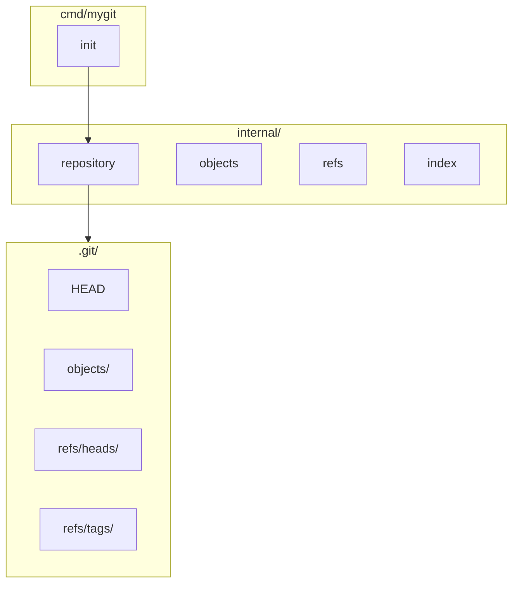

# mygit

A Git clone built from scratch in Go, reimplementing Git's core architecture from first principles.

Inspired by [Build Your Own X](https://github.com/codecrafters-io/build-your-own-x) and the [Build Your Own Git](https://app.codecrafters.io/courses/git/overview) challenge.

## Status

| Phase | Feature | Status |
|-------|---------|--------|
| 1 | `init` | ✅ Complete |
| 2 | Blob objects (`hash-object`, `cat-file`) | ✅ Complete |
| 3 | Tree objects (`write-tree`, `ls-tree`) | ✅ Complete |
| 4 | Commits | ✅ Complete |
| 5 | Log | ✅ Complete |
| 6 | Branches | ✅ Complete |
| 7 | Status | 🔜 Planned |
| 8 | Staging (`add`, index) | 🔜 Planned |
| 9 | Diff | 🔜 Planned |
| 10 | Merge | 🔜 Planned |
| 11 | Clone | 🔜 Planned |
| 12 | Push / Pull | 🔜 Planned |

## Architecture



## Repository Layout

After `mygit init`, the following structure is created:

```text
.git/
├── HEAD                 # symbolic ref → refs/heads/main
├── objects/             # content-addressable object store (Phase 2+)
├── refs/
│   ├── heads/           # branch pointers
│   └── tags/            # tag pointers
```

## Quick Start

```bash
# Build
make build

# Initialize a repository
./bin/mygit init

# Hash and store a file as a blob object
echo "hello world" > file.txt
./bin/mygit hash-object -w file.txt
# 3b18e512dba79e4c8300dd08aeb37f8e728b8dad

# Read object content back
./bin/mygit cat-file 3b18e512dba79e4c8300dd08aeb37f8e728b8dad

# Build a tree from the working directory
./bin/mygit write-tree
./bin/mygit ls-tree <tree-hash>

# Create a commit (snapshots working tree, updates main branch)
./bin/mygit commit -m "Initial commit"

# View commit history
./bin/mygit log

# Branches
./bin/mygit branch feature
./bin/mygit checkout feature
```

## Development

```bash
make test          # run all tests
make test-cover    # coverage report
make lint          # go vet
```

## Project Structure

```text
mygit/
├── cmd/mygit/           # CLI entrypoint (Cobra)
├── internal/
│   ├── repository/      # repo discovery, init
│   ├── objects/         # blob/tree/commit objects (Phase 2+)
│   ├── refs/            # references (Phase 6+)
│   ├── index/           # staging area (Phase 8+)
│   ├── hash/            # SHA-1 (Phase 2+)
│   ├── storage/         # object store (Phase 2+)
│   ├── commit/          # commits (Phase 4+)
│   ├── tree/            # trees (Phase 3+)
│   ├── branch/          # branches (Phase 6+)
│   ├── merge/           # merges (Phase 10+)
│   ├── diff/            # diff engine (Phase 9+)
│   └── remote/          # clone/push/pull (Phase 11+)
├── tests/
│   ├── integration/
│   └── cli/
└── docs/
```

