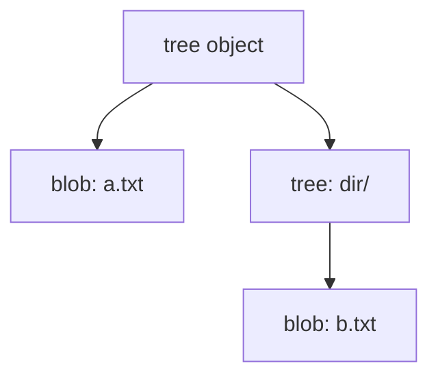

# Git Objects — Trees

## What Is a Tree?

A **tree** object represents a directory snapshot. It maps filenames to object hashes — either blob hashes (files) or other tree hashes (subdirectories).

```text
tree (root)
├── a.txt  →  blob
└── dir/   →  tree
              └── b.txt  →  blob
```

Trees form the bridge between the filesystem hierarchy and Git's flat object store.

## Tree Object Structure

Tree content is a concatenation of fixed-format records:

```text
<mode> <name>\0<20-byte-binary-sha1>
<mode> <name>\0<20-byte-binary-sha1>
...
```

| Field | Description |
|-------|-------------|
| `<mode>` | File type + permissions (ASCII octal) |
| `<name>` | Filename (no path separators) |
| `\0` | Null terminator |
| `<sha1>` | 20-byte binary hash (not hex) |

### Common Modes

| Mode | Meaning |
|------|---------|
| `100644` | Regular file |
| `100755` | Executable file |
| `40000` | Directory (tree) — stored without leading zero in object encoding |
| `040000` | Directory — display format used by `ls-tree` |
| `120000` | Symbolic link |

Entries are sorted by **name** in byte order before storage.

## Relationship Between Trees and Blobs



- **Blobs** store content
- **Trees** store structure
- A commit (Phase 4) points to one root tree

## Empty Tree

A tree with zero entries has empty content. Its hash is always:

```text
4b825dc642cb6eb9a060e54bf8d69288fbee4904
```

## `write-tree` Algorithm

```
1. Read directory entries (skip .git)
2. For each file:
     a. Read bytes → write blob → record entry
3. For each subdirectory:
     a. Recurse → get tree hash → record entry
4. Sort entries by name
5. Encode tree → write tree object
6. Return root tree hash
```

> **Note:** Real Git's `write-tree` reads from the **index** (staging area). mygit walks the working directory until Phase 8 implements the index.

## Commands

```bash
mygit write-tree              # build tree from working directory
mygit ls-tree <hash>          # list tree entries
```

### `ls-tree` Output Format

```text
<mode> <type> <hash>\t<name>
```

Example:

```text
100644 blob 3b18e512dba79e4c8300dd08aeb37f8e728b8dad    file.txt
040000 tree abc123...                                      subdir
```

## Design Decisions

| Decision | Rationale |
|----------|-----------|
| `internal/tree` package | Separates encoding from storage and CLI |
| Working-tree walk (for now) | Index not yet implemented; enables Phase 3 testing |
| Git-compatible encoding | Verified against `git mktree` in integration tests |
| Skip non-regular files | Symlinks/submodules deferred to later phases |
