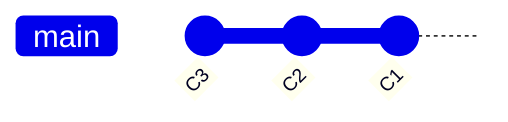

# Git Objects — Commits

## What Is a Commit?

A **commit** is a snapshot pointer into the repository history. It binds together:

- A **tree** (directory snapshot)
- Zero or more **parents** (prior commits)
- **Author** and **committer** metadata
- A **message**

```text
commit → tree → blobs
   ↓
 parent → commit → tree → ...
```

## Commit Object Format

```text
tree <tree-hash>
parent <parent-hash>        # omitted on root commit; multiple for merges
author Name <email> <unix-timestamp> <timezone>
committer Name <email> <unix-timestamp> <timezone>

<commit message>
```

Example:

```text
tree 9a8554f34fc07de5e2ed7005ac49f4bc8353400b
author Test User <test@example.com> 1717654321 +0000
committer Test User <test@example.com> 1717654321 +0000

Initial commit
```

| Field | Purpose |
|-------|---------|
| `tree` | Root tree hash for this snapshot |
| `parent` | Previous commit(s); forms the DAG edges |
| `author` | Who wrote the changes |
| `committer` | Who created the commit object |
| message | Human-readable description (after blank line) |

## The Commit Graph (DAG)

Commits form a **Directed Acyclic Graph**:



- Each commit has ≥0 parents
- Root commit has no parent
- Merge commits have 2+ parents (Phase 10)
- Branches are pointers into this graph (`refs/heads/main`)

## `mygit commit` Algorithm

```
1. Resolve HEAD → current branch + parent commit hash
2. write-tree → snapshot working directory
3. Build commit object (tree, parent, author, message)
4. SHA-1 + zlib → store in .git/objects/
5. Update refs/heads/<branch> → new commit hash
```

## Commands

```bash
mygit commit -m "Initial commit"
```

Environment variables (optional):

| Variable | Default |
|----------|---------|
| `GIT_AUTHOR_NAME` | `mygit` |
| `GIT_AUTHOR_EMAIL` | `mygit@localhost` |

## First Commit Side Effect

Before the first commit:

```text
HEAD → refs/heads/main → (missing)
```

After:

```text
HEAD → refs/heads/main → <commit-sha>
```

This is when `refs/heads/main` is created.

## History Traversal (`log`)

`mygit log` walks the commit DAG from HEAD, following **first-parent** links:

```text
HEAD → C3 → C2 → C1 → (stop: no parent)
```

Output format:

```text
commit <full-hash>
Author: Name <email>
Date:   Sat Jun 6 12:00:00 2026 +0000

commit message
```

Algorithm:

1. Resolve HEAD → starting commit hash
2. Load commit object from object store
3. Append to output; follow `parents[0]`
4. Repeat until no parents (or `-n` limit reached)

Merge commits with multiple parents are covered in Phase 10; until then, only the first parent is followed.

## Design Decisions

| Decision | Rationale |
|----------|-----------|
| `internal/refs` package | Separates reference mechanics from commit logic |
| Working-tree snapshot | Index-based commits arrive in Phase 8 |
| Detached HEAD blocked | Avoids commits that don't advance any branch |
| Git-compatible serialization | Verified with `git hash-object -t commit` |
