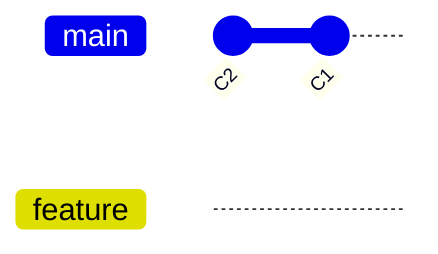

# Branches and HEAD

## Branch Pointers

A **branch** is a movable pointer to a commit. Stored as a plain text file:

```text
.git/refs/heads/main  →  <40-char-commit-sha>
```

Multiple branches can point at the same commit. Each new commit advances only the branch that HEAD references.

## HEAD: Where Am I?

```text
HEAD  →  refs/heads/main  →  commit C3
```

| HEAD state | File contents | Meaning |
|------------|---------------|---------|
| On branch | `ref: refs/heads/main` | Commits update `main` |
| Detached | `abc1234...` (raw hash) | Commits don't update any branch |

## Commands

```bash
mygit branch                 # list branches (* = current)
mygit branch feature         # create branch at current commit
mygit checkout feature       # switch to branch
mygit checkout <commit-hash> # detached HEAD
```

## Algorithms

### Create branch

```
1. Read HEAD → current commit hash
2. Write refs/heads/<name> = commit hash
```

### Checkout branch

```
1. Verify refs/heads/<name> exists
2. Write HEAD = "ref: refs/heads/<name>"
```

### Checkout commit (detached)

```
1. Validate 40-char hash
2. Write HEAD = "<hash>"
```

> **Note:** Real Git also updates the working tree on checkout. mygit updates HEAD/refs only until working-tree checkout is added in a later phase.

## Branch DAG View



`main` and `feature` are labels pointing into the same commit graph. `checkout` moves HEAD between labels.

## Design Decisions

| Decision | Rationale |
|----------|-----------|
| `internal/branch` package | Branch operations isolated from low-level refs |
| Create does not switch | Matches Git: `branch` vs `checkout` |
| Detached HEAD supported | Required for later merge/tag workflows |
| No working-tree sync yet | Index/checkout file sync comes with status/add phases |
